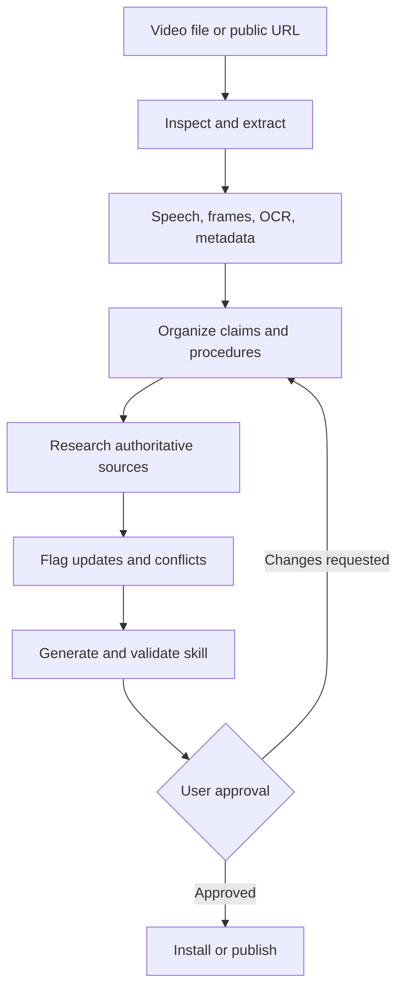

<div align="center">


# Video to Skill

### Turn any video into reusable agent knowledge.

**Video to Skill** converts local videos and supported public video URLs into complete, source-grounded agent skills. It extracts speech and visual evidence, researches important claims, flags inconsistencies, validates the generated package, and asks for approval before anything is installed or published.

[](LICENSE.md)
[](https://www.python.org/)
[](#verification)
[](#project-status)

</div>

---

## Why Video to Skill?

A normal video summary tells you what a video was about. Video to Skill turns what the video teaches into a reusable operating system for an AI agent.

It captures:

- Timestamped speech and subtitle evidence
- Important frames, slides, interfaces, commands, and demonstrations
- Procedures, concepts, tools, warnings, and decision rules
- Claims that may be outdated, incomplete, or disputed
- Current authoritative research supporting or challenging those claims
- A complete skill package designed for progressive, on-demand loading

The result is structured knowledge an agent can use repeatedly—not a transcript dump and not a one-time summary.

## How It Works



The deterministic pipeline handles media extraction and provenance. The agent workflow interprets evidence, asks focused questions, performs research, generates the candidate skill, and presents a plain-language preview before installation.

## Core Features

| Capability | What it does |
|---|---|
| Local video intake | Accepts common formats including MP4, MOV, MKV, WebM, AVI, M4V, MPEG, and MPG |
| Public URL intake | Uses `yt-dlp` for supported public URLs without bypassing authentication, DRM, or paywalls |
| Subtitle extraction | Reuses timestamped SRT or WebVTT evidence when available |
| Local transcription | Falls back to Whisper or faster-whisper when subtitles are unavailable |
| Visual analysis | Samples timestamped frames for slides, interfaces, diagrams, demonstrations, and state changes |
| OCR | Uses Tesseract to recover visible text from sampled frames |
| Provenance | Hashes source media and extracted frames with SHA-256 |
| Claim detection | Identifies material statements that may require verification |
| Current research | Directs the agent to authoritative, first-party, standards, and primary research sources |
| Conflict reporting | Preserves what the video says and what current evidence says instead of silently replacing either |
| Approval gate | Blocks installation and publication until the user approves the exact candidate |
| Validation | Checks both the skill structure and the evidence contract |

## What It Generates

A finished conversion can produce:

```text
generated-skill/
├── SKILL.md
├── topics/
├── procedures/
├── examples/
├── transcript/
├── frames/
├── glossary.md
├── patterns.md
├── cheatsheet.md
├── sources.md
├── claims.md
├── inconsistencies.md
└── generation-report.json
```

Only useful, evidence-supported files are created. Empty folders and artificial padding are excluded.

### Evidence Model

Every material instruction can be traced through stable identifiers:

| Prefix | Evidence type |
|---|---|
| `VID-###` | Timestamped speech, captions, or transcript evidence |
| `FRM-###` | Sampled frame, visible demonstration, or OCR evidence |
| `USR-###` | A clarification supplied by the user |
| `WEB-###` | An external authoritative source |
| `INF-###` | An explicitly labeled inference |

Researched claims are labeled `confirmed`, `updated`, `conflicted`, `unverified`, or `not-researched`.

## Requirements

### Required

- Python 3.10 or newer
- `ffmpeg`
- `ffprobe`

### Optional

- `yt-dlp` for supported public video URLs
- `faster-whisper` or the Whisper CLI for local transcription
- Tesseract for on-screen text extraction

## Installation

Clone the repository and create an isolated Python environment:

```bash
git clone https://github.com/AndersonPaulinoDev/video-to-skill.git
cd video-to-skill

python3 -m venv .venv
source .venv/bin/activate
pip install -e '.[all]'
```

Check which local capabilities are available:

```bash
video-to-skill doctor
```

### Install as an Agent Skill

For Agent Skills-compatible hosts:

```bash
npx skills add AndersonPaulinoDev/video-to-skill
```

You can also place the repository in the skills directory used by your agent host.

## Usage

### Analyze a local video

```bash
video-to-skill analyze ./videos/tutorial.mp4 \
  --output ./work/tutorial
```

### Analyze a supported public URL

```bash
video-to-skill analyze 'https://example.com/public-video' \
  --output ./work/public-video
```

### Control frame sampling

```bash
video-to-skill analyze ./videos/demo.mp4 \
  --output ./work/demo \
  --frame-interval 30 \
  --max-frames 120
```

The analysis directory includes:

```text
work/demo/
├── manifest.json
├── transcript.jsonl
├── frames.json
├── ocr.json
├── claims.json
├── preview.json
└── frames/
```

The agent then follows the repository’s `SKILL.md` workflow to interpret the evidence, research claims, generate the skill, validate it, and request approval.

## Approval Preview

Before installation or publication, the user sees a plain-language report containing:

- Proposed skill name and purpose
- Videos and processing methods used
- Extracted topics, procedures, examples, and tools
- Questions answered and gaps still unresolved
- External sources consulted
- Confirmed, updated, conflicted, and unverified claims
- Files that will be installed
- Validation results
- Privacy, copyright, and redistribution cautions

No candidate is installed or published until the user explicitly approves that preview.

## Architecture

```text
video_to_skill/
├── ingest/       # Local paths, URL safety, and public URL acquisition
├── extract/      # Media probing, subtitles, transcription, frames, and OCR
├── analyze/      # Candidate claim detection and evidence organization
├── generate/     # Approval preview and generated-skill preparation
├── pipeline.py   # End-to-end deterministic extraction workflow
├── provenance.py # SHA-256 records and machine-readable output
└── cli.py        # doctor and analyze commands
```

Supporting layers include:

- `SKILL.md` for the agent-operated research and generation workflow
- `references/` for processing and output contracts
- `tools/` for generated-skill validation
- `tests/` for unit and real ffmpeg integration coverage
- `.github/workflows/` for continuous verification

See [`docs/architecture.md`](docs/architecture.md) for the component boundary.

## Safety and Privacy

Video files, subtitles, OCR, transcripts, URLs, and metadata are treated as untrusted input.

Video to Skill does not:

- Execute commands extracted from a video
- Bypass authentication, DRM, paywalls, or platform restrictions
- Accept credentials embedded in URLs
- Overwrite a non-empty output directory
- Publish a generated skill automatically
- Include complete transcripts or copyrighted source media by default

Working directories may contain sensitive frames, captions, audio, and metadata. Review and remove them when they are no longer needed.

## Copyright

This repository contains the converter—not third-party videos or generated reproductions. Process material you are authorized to access. Publishing a generated skill derived from copyrighted material may require permission even when private personal use is allowed.

Generated skills should synthesize knowledge and use short, necessary evidence excerpts rather than reproduce the underlying video.

## Verification

The current candidate has been verified with:

- 15 automated tests
- Ruff static analysis
- Skill structure validation
- A real ffmpeg integration test
- An end-to-end generated-video test covering subtitles, sampled frames, provenance, candidate claims, and the approval lock

Run the checks locally:

```bash
python3 -m pytest -q
python3 -m ruff check .
python3 tools/validate_generated_skill.py ./path/to/generated-skill
```

## Project Status

Video to Skill is in early development. The extraction foundation, provenance model, approval gate, and validators are implemented. Future work will deepen scene detection, semantic topic generation, visual deduplication, multilingual evaluation, and host compatibility testing.

## Contributing

Contributions are welcome. Please read [`CONTRIBUTING.md`](CONTRIBUTING.md) before opening a pull request.

When contributing:

- Preserve timestamped provenance
- Keep extraction deterministic
- Add tests for new behavior and bug fixes
- Do not commit copyrighted videos, transcripts, credentials, or sensitive fixtures
- Do not weaken the approval or access-control boundaries

Security concerns should follow [`SECURITY.md`](SECURITY.md).

## License

Released under the [MIT License](LICENSE.md).

---

<div align="center">

**Built by [BNS Foundry](https://bnsfoundry.com)**

*Turn video knowledge into something your agent can actually use.*

</div>
