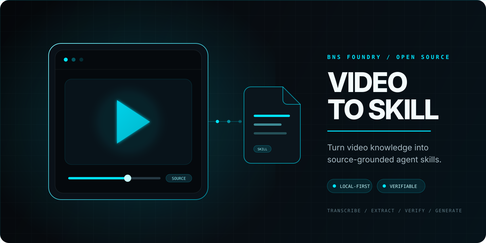
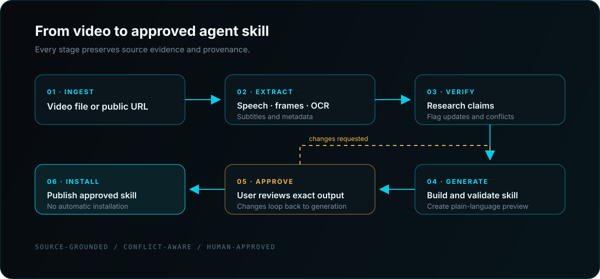

<div align="center">



# Video to Skill

### Turn any video into reusable agent knowledge.

**Video to Skill** converts local videos and supported public video URLs into complete, source-grounded agent skills. It extracts speech and visual evidence, researches important claims, flags inconsistencies, validates the generated package, and asks for approval before anything is installed or published.

[](LICENSE.md)
[](#v100--first-public-release)
[](https://www.python.org/)
[](#verification)
[](#project-status)

</div>

---

## v1.0.0 — First Public Release

This is the first version of Video to Skill released for public use. It brings
the complete local-first workflow together in one installable open-source tool:

- Convert a single video, public video URL, playlist, or course
- Extract timestamped transcript and visual evidence
- Resume interrupted analysis without repeating completed work
- Merge multiple videos while preserving agreements and contradictions
- Research important claims against current authoritative sources
- Generate operational, learning, hybrid, or reference skills
- Redact common personal information before publication
- Preview, validate, approve, package, and install the exact generated skill

The five builds before v1.0.0 were private development iterations. **v1.0.0 is
the beginning of the public release history.**

---

## Why Video to Skill?

A normal video summary tells you what a video was about. Video to Skill turns what the video teaches into a reusable operating system for an AI agent.

It captures:

- Timestamped speech and subtitle evidence
- Important frames, slides, interfaces, commands, and demonstrations
- Procedures, concepts, tools, warnings, and decision rules
- Claims that may be outdated, incomplete, or disputed
- Current authoritative research supporting or challenging those claims
- A complete skill package designed for progressive, on-demand loading

The result is structured knowledge an agent can use repeatedly—not a transcript dump and not a one-time summary.

## How It Works



The deterministic pipeline handles media extraction and provenance. The agent workflow interprets evidence, asks focused questions, performs research, generates the candidate skill, and presents a plain-language preview before installation.

## Core Features

| Capability | What it does |
|---|---|
| Local video intake | Accepts common formats including MP4, MOV, MKV, WebM, AVI, M4V, MPEG, and MPG |
| Public URL intake | Uses `yt-dlp` for supported public URLs without bypassing authentication, DRM, or paywalls |
| Subtitle extraction | Reuses timestamped SRT or WebVTT evidence when available |
| Local transcription | Falls back to Whisper or faster-whisper when subtitles are unavailable |
| Visual analysis | Samples timestamped frames for slides, interfaces, diagrams, demonstrations, and state changes |
| Resumable workspaces | Records stage progress in SQLite and continues interrupted analysis without repeating completed work |
| Scene-aware sampling | Detects RGB scene changes and removes near-duplicate frames before OCR |
| Visual reinspection | Extracts an exact moment or bounded dense window and promotes it into citable frame evidence |
| Courses and playlists | Inventories, resumes, and merges multiple videos with explicit coverage |
| Multi-source provenance | Renumbers evidence globally, combines agreements, and preserves contradictions |
| Publication redaction | Removes common PII and explicitly named people from generated files by default |
| Usage modes | Generates operational, learning, hybrid, or reference-oriented skills |
| OCR | Uses Tesseract to recover visible text from sampled frames |
| Provenance | Hashes source media and extracted frames with SHA-256 |
| Claim detection | Identifies material statements that may require verification |
| Current research | Directs the agent to authoritative, first-party, standards, and primary research sources |
| Conflict reporting | Preserves what the video says and what current evidence says instead of silently replacing either |
| Approval gate | Blocks installation and publication until the user approves the exact candidate |
| Validation | Checks both the skill structure and the evidence contract |
| Evaluation harness | Runs owned synthetic videos through the real pipeline and enforces measurable regression thresholds |

## What It Generates

A finished conversion can produce:

```text
generated-skill/
├── SKILL.md
├── sources.md
├── claims.md
├── inconsistencies.md
├── PREVIEW.md
├── generation-report.json
├── redaction-report.json
└── references/
    ├── knowledge.md
    └── learning-guide.md  # learning/hybrid mode
```

Only useful, evidence-supported files are created. Empty folders and artificial padding are excluded.

### Evidence Model

Every material instruction can be traced through stable identifiers:

| Prefix | Evidence type |
|---|---|
| `VID-###` | Timestamped speech, captions, or transcript evidence |
| `FRM-###` | Sampled frame, visible demonstration, or OCR evidence |
| `USR-###` | A clarification supplied by the user |
| `WEB-###` | An external authoritative source |
| `INF-###` | An explicitly labeled inference |

Researched claims are labeled `confirmed`, `updated`, `conflicted`, `unverified`, or `not-researched`.

## Requirements

### Required

- Python 3.10 or newer
- `ffmpeg`
- `ffprobe`

### Optional

- `yt-dlp` for supported public video URLs
- `faster-whisper` or the Whisper CLI for local transcription
- Tesseract for on-screen text extraction

## Installation

Clone the repository and create an isolated Python environment:

```bash
git clone https://github.com/AndersonPaulinoDev/video-to-skill.git
cd video-to-skill

python3 -m venv .venv
source .venv/bin/activate
pip install -e '.[all]'
```

Check which local capabilities are available:

```bash
video-to-skill doctor
```

### Install as an Agent Skill

For Agent Skills-compatible hosts:

```bash
npx skills add AndersonPaulinoDev/video-to-skill
```

You can also place the repository in the skills directory used by your agent host.

## Usage

### Analyze a local video

```bash
video-to-skill analyze ./videos/tutorial.mp4 \
  --output ./work/tutorial
```

### Analyze a supported public URL

```bash
video-to-skill analyze 'https://example.com/public-video' \
  --output ./work/public-video
```

### Control frame sampling

```bash
video-to-skill analyze ./videos/demo.mp4 \
  --output ./work/demo \
  --frame-interval 30 \
  --max-frames 120
```

The analysis directory includes:

```text
work/demo/
├── manifest.json
├── transcript.jsonl
├── frames.json
├── ocr.json
├── claims.json
├── preview.json
└── frames/
```

The agent then follows the repository’s `SKILL.md` workflow to interpret the evidence, ask necessary questions, and create validated `research.json` and `knowledge.json` inputs.

### Analyze a playlist or course

```bash
video-to-skill course-inventory <playlist-url-or-inventory.json> \
  --output ./course.json

video-to-skill course-analyze ./course.json \
  --output ./work/course
```

Each source receives an isolated resumable workspace. Successful sources are merged into `work/course/merged`; failed or inaccessible sources remain visible in `course-report.json` and in the candidate approval preview.

To merge analyses you already completed:

```bash
video-to-skill merge ./work/lesson-1 ./work/lesson-2 \
  --output ./work/combined \
  --title "Combined course"
```

### Resume or inspect progress

```bash
video-to-skill progress ./work/demo

video-to-skill analyze ./videos/demo.mp4 \
  --output ./work/demo \
  --resume
```

Resume requires the same source and extraction settings. Completed stages are reused; changed or missing media is rejected instead of silently mixing evidence.

### Reinspect an important visual moment

```bash
video-to-skill inspect-frame ./work/demo 01:23.5

video-to-skill inspect-window ./work/demo \
  --start 01:20 \
  --end 01:26 \
  --fps 2
```

Dense windows are capped at 60 frames. Selected frames are hashed and assigned normal `FRM-###` identifiers so generated knowledge can cite them.

### Generate the candidate

```bash
video-to-skill generate ./work/demo \
  --output ./candidates/demo-skill \
  --name demo-skill \
  --description "Use when an agent needs the demonstrated workflow." \
  --research ./research.json \
  --knowledge ./knowledge.json
```

Select how the generated skill should be used and add names requiring publication redaction:

```bash
video-to-skill generate ./work/course/merged \
  --output ./candidates/course-skill \
  --name course-skill \
  --description "Teach and apply the course method." \
  --mode hybrid \
  --redact-name "Private Name"
```

Email, phone, government-ID, and explicitly supplied name redaction is enabled by default. Raw analysis evidence is never rewritten. `--no-redact-pii` is available only for deliberately unredacted output.

The input schemas are documented in [`references/input-contracts.md`](references/input-contracts.md). The generated candidate is integrity-hashed and remains blocked from installation.

### Approve and install

After reviewing `PREVIEW.md`, `claims.md`, and `inconsistencies.md`:

```bash
video-to-skill approve ./candidates/demo-skill --by "Your Name"
video-to-skill install ./candidates/demo-skill --skills-dir ~/.codex/skills
```

Approval is authenticated with a local key and bound to the candidate digest. Modifying material files after generation invalidates approval. The key is created with owner-only permissions at `~/.config/video-to-skill/approval.key`; set `VIDEO_TO_SKILL_APPROVAL_KEY_FILE` to use another protected location.

To create a verified archive for authorized redistribution:

```bash
video-to-skill package ./candidates/demo-skill \
  --output ./dist/demo-skill.zip
```

### Run the evaluation suite

The repository includes four small, synthetic fixtures authored for this project; it contains no third-party video or transcript material. Run them through the actual converter with:

```bash
video-to-skill evaluate \
  --manifest evals/manifest.json \
  --output eval-report.json
```

The suite measures analysis accuracy, generated structure, claim classification, evidence retention, knowledge extraction, conflict reporting, publication privacy, and approval-gate safety. A run fails if its aggregate score is below `0.95` or if any expected behavior is missing.

## Approval Preview

Before installation or publication, the user sees a plain-language report containing:

- Proposed skill name and purpose
- Videos and processing methods used
- Extracted topics, procedures, examples, and tools
- Questions answered and gaps still unresolved
- External sources consulted
- Confirmed, updated, conflicted, and unverified claims
- Files that will be installed
- Validation results
- Privacy, copyright, and redistribution cautions

No candidate is installed or published until the user explicitly approves that preview.

## Architecture

```text
video_to_skill/
├── ingest/       # Local paths, URL safety, and public URL acquisition
├── extract/      # Media probing, subtitles, transcription, frames, and OCR
├── analyze/      # Candidate claim detection and evidence organization
├── generate/     # Approval preview and generated-skill preparation
├── evals/        # Deterministic end-to-end scoring engine
├── workspace.py  # SQLite stage recovery and progress reporting
├── pipeline.py   # End-to-end deterministic extraction workflow
├── provenance.py # SHA-256 records and machine-readable output
└── cli.py        # converter lifecycle and evaluation commands
```

Supporting layers include:

- `SKILL.md` for the agent-operated research and generation workflow
- `references/` for processing and output contracts
- `tools/` for generated-skill validation
- `tests/` for unit and real ffmpeg integration coverage
- `.github/workflows/` for continuous verification

See [`docs/architecture.md`](docs/architecture.md) for the component boundary.

## Safety and Privacy

Video files, subtitles, OCR, transcripts, URLs, and metadata are treated as untrusted input.

Video to Skill does not:

- Execute commands extracted from a video
- Bypass authentication, DRM, paywalls, or platform restrictions
- Accept credentials embedded in URLs
- Overwrite a non-empty output directory
- Publish a generated skill automatically
- Include complete transcripts or copyrighted source media by default

Working directories may contain sensitive frames, captions, audio, and metadata. Review and remove them when they are no longer needed.

## Copyright

This repository contains the converter—not third-party videos or generated reproductions. Process material you are authorized to access. Publishing a generated skill derived from copyrighted material may require permission even when private personal use is allowed.

Generated skills should synthesize knowledge and use short, necessary evidence excerpts rather than reproduce the underlying video.

## Verification

The current candidate has been verified with:

- 50 automated tests
- Ruff static analysis
- Skill structure validation
- A real ffmpeg integration test
- An end-to-end generated-video test covering subtitles, sampled frames, provenance, candidate claims, and the approval lock
- A four-case synthetic evaluation suite with a 0.95 regression threshold, including publication privacy
- Interrupted-run recovery, RGB scene-cut, deduplication, and bounded reinspection tests

Run the checks locally:

```bash
python3 -m pytest -q
python3 -m ruff check .
video-to-skill evaluate --manifest evals/manifest.json
python3 tools/validate_generated_skill.py ./path/to/generated-skill
```

## Project Status

Video to Skill v1.0.0 is the first public release. Extraction, validated research and knowledge inputs, resumable workspaces, scene-aware visual analysis, bounded reinspection, playlist/course aggregation, multi-video merging, publication redaction, generated usage modes, conflict reporting, digest-bound approval, verified installation, ZIP packaging, and deterministic end-to-end evaluation are implemented. The next phase focuses on real-user installation testing, examples made from openly licensed videos, broader host compatibility, multilingual evaluation, and performance benchmarks.

## Contributing

Contributions are welcome. Please read [`CONTRIBUTING.md`](CONTRIBUTING.md) before opening a pull request.

When contributing:

- Preserve timestamped provenance
- Keep extraction deterministic
- Add tests for new behavior and bug fixes
- Do not commit copyrighted videos, transcripts, credentials, or sensitive fixtures
- Do not weaken the approval or access-control boundaries

Security concerns should follow [`SECURITY.md`](SECURITY.md).

## Related projects

Video to Skill was originally inspired by [`book-to-skill`](https://github.com/virgiliojr94/book-to-skill). Its resumable-workspace and course-coverage direction was informed by [`Lum1104/video-to-skill`](https://github.com/Lum1104/video-to-skill), while bounded visual reinspection and RGB-aware scene analysis were informed by [`brenoepics/video-to-skill`](https://github.com/brenoepics/video-to-skill). This repository remains an independent implementation centered on authoritative research, explicit conflict reporting, authenticated approval, and measurable evaluation.

## License

Released under the [MIT License](LICENSE.md).

---

<div align="center">

**Built by [Anderson Paulino](https://bnsfoundry.com)**

*Turn video knowledge into something your agent can actually use.*

</div>
